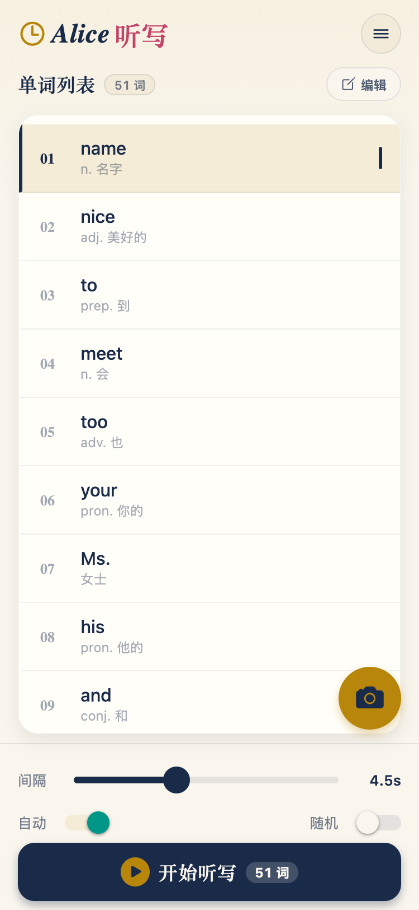
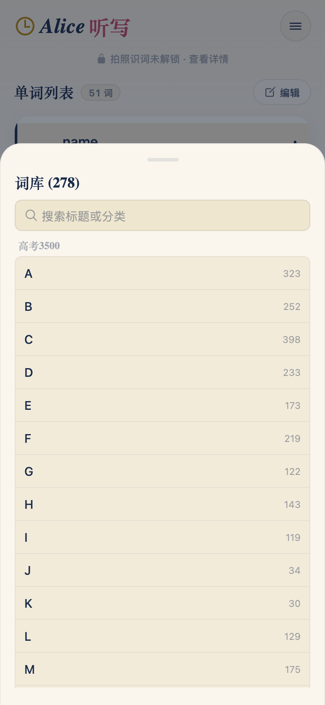
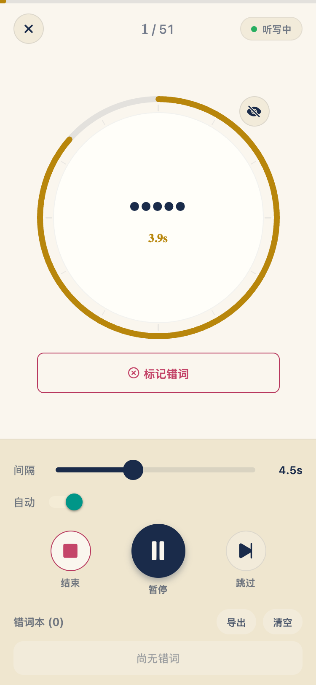
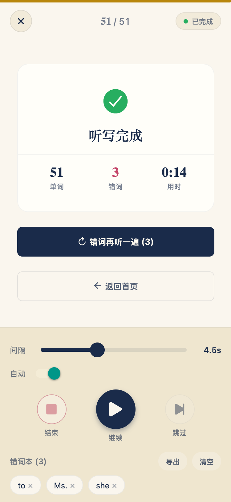

# Alice 听写 🐰

> "Down the rabbit-hole of words."

[](LICENSE)
[](https://expo.dev)
[](https://reactnative.dev)
[](https://alice.edao.plus)

英文单词听写应用，基于 Expo (React Native)，支持 iOS / Android / Web。

官网与下载：**<https://alice.edao.plus>**

## 截图

| 首页 | 词库 | 听写 | 完成 |
| :---: | :---: | :---: | :---: |
|  |  |  |  |

## 功能

- 粘贴英文单词列表 / 拍照 OCR 识别（Android 默认智谱 GLM-4V；支持自定义 OCR 服务商；Web 版需自备 API Key）
- 内置教材词库：中考 1600、高考 3500、人教 / 外研 / 闽教版单元词表，支持搜索
- 可调间隔、自动播放下一个
- 显示 / 隐藏当前单词，词性与释义提示
- 标记错词，本地持久化，历史记录管理
- 导出错词到剪贴板
- 亮色 / 暗色主题

## 技术栈

- **Expo / React Native** — 跨平台移动应用
- **系统 en-US TTS** — 英文单词发音（`expo-speech`）
- **智谱 GLM-4V** — 视觉 OCR 识别
- **Vite + React + Tailwind CSS** — 官网（`website/` 子包）

## 快速开始

```bash
git clone https://github.com/vvenv/alice.git
cd alice
pnpm install
cp .env.example .env   # 填入自己的密钥（见下方「配置」）

pnpm start          # Expo dev server
pnpm web            # Web 模式
pnpm ios            # iOS 模拟器
pnpm android        # Android 模拟器
```

官网本地开发：

```bash
pnpm --filter website dev
```

## 配置

所有敏感配置放在 gitignored 的 `.env` 中（模板见 [`.env.example`](.env.example)），由 [`app.config.js`](app.config.js) 在构建时注入：

| 环境变量 | 说明 | 必填 |
|------|------|------|
| `ZHIPU_API_KEY` | 智谱 API Key（OCR 拍照识词），[申请地址](https://open.bigmodel.cn/) | Android OCR 需要；Web 构建不会注入 |
| `DEPLOY_SERVER` | 发布脚本的部署目标（`user@host`） | 仅发版需要 |
| `DEPLOY_REMOTE_DIR` | 服务器上的站点目录 | 仅发版需要 |

非敏感配置在 `app.json` 的 `expo.extra` 中（`zhipuBaseUrl`、`visionModel`）。

云端 CI 构建（GitHub Actions → EAS）不读取本地 `.env`，需在 [EAS 环境变量](https://docs.expo.dev/eas/environment-variables/) 中配置同名变量。

## 发版

### 一键 Android 发版（本地构建 + 部署官网）

```bash
pnpm release:android           # 保持当前版本发版
pnpm release:android patch     # 0.2.0 → 0.2.1
pnpm release:android minor     # 0.2.0 → 0.3.0
pnpm release:android major     # 0.2.0 → 1.0.0
pnpm release:android 0.3.0     # 指定版本号
```

传入 bump 类型或版本号时，会同步更新 `package.json`、`app.json`（含 `android.versionCode`）、`android/app/build.gradle`、iOS `MARKETING_VERSION` / `CURRENT_PROJECT_VERSION`。

流程：可选升版 → EAS 本地构建 APK → 暂存到 `website/public/downloads/` → 更新下载链接 → 构建官网 → rsync 部署到 `DEPLOY_SERVER`。详见 [`scripts/release.sh`](scripts/release.sh)。

### 发布官网 + Web 应用

```bash
pnpm release:website              # 落地页 + /app/（推荐）
pnpm release:website -- --skip-webapp  # 仅落地页
pnpm release:webapp               # 仅更新 /app/
```

官网与 Web 应用**无先后顺序要求**：落地页 rsync 会排除 `downloads/` 和 `app/`，不会互相覆盖。`release:website` 默认一并发布 Web 应用。入口：<https://alice.edao.plus/app/>。

详见 [`scripts/release-website.sh`](scripts/release-website.sh)、[`scripts/release-webapp.sh`](scripts/release-webapp.sh)。

### GitHub Actions 发版

首次需在本地 `pnpm exec eas login && pnpm exec eas init`，并在 GitHub → Settings → Secrets → Actions 添加 `EXPO_TOKEN`。之后在 **Actions → CI → Run workflow** 选择 platform / profile 触发。

## 项目结构

```
├── App.tsx / index.js      # 应用入口
├── app.json                # Expo 静态配置（不含密钥）
├── app.config.js           # 动态配置：从 .env 注入密钥
├── src/
│   ├── screens/            # 页面（首页、听写）
│   ├── components/         # UI 组件
│   └── lib/                # 配置、OCR、存储等
├── data/                   # 内置词库（教材单元 / 中高考词表）
├── docs/                   # 文档资源（README 截图等）
├── scripts/                # 发版、词典构建脚本
└── website/                # 官网（Vite + React + Tailwind）
```

## 贡献

欢迎 Issue 和 PR！请先阅读 [贡献指南](CONTRIBUTING.md)。

## 许可证

[MIT](LICENSE) © 2026 vvenv
