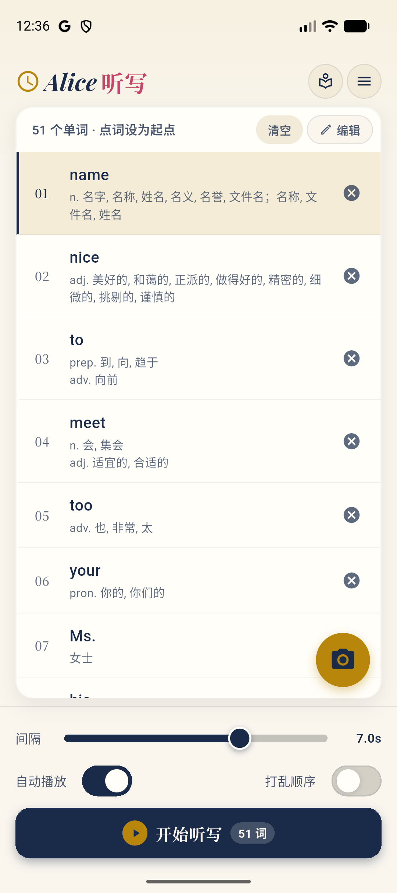
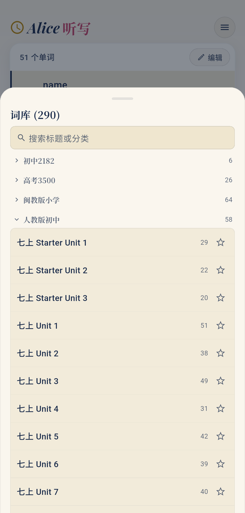
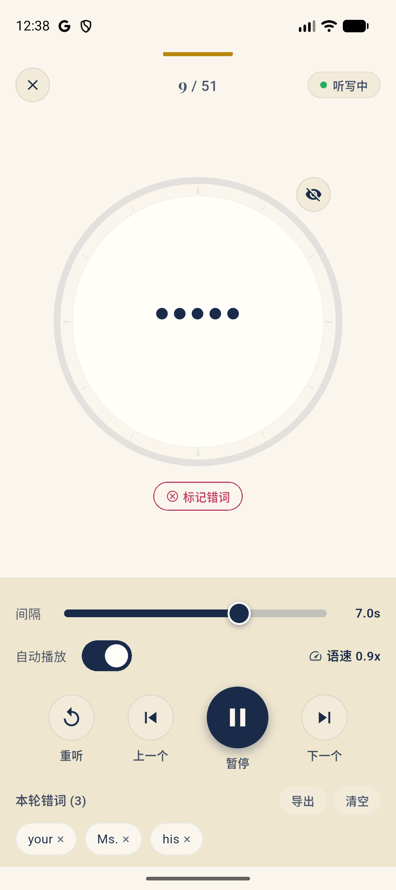
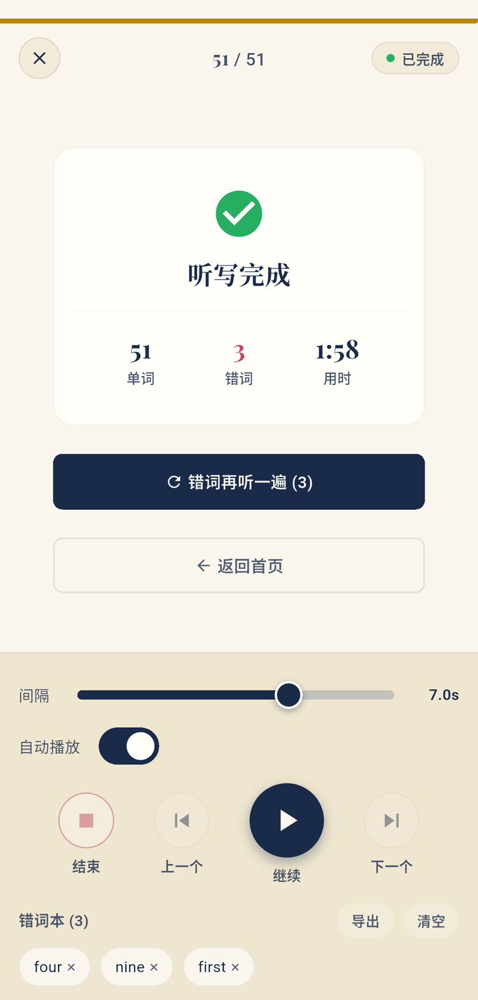

# Alice 听写 🐰

> "Down the rabbit-hole of words."

[](LICENSE)
[](https://flutter.dev)
[](https://alice.edao.plus)

英文单词听写应用，Flutter 实现，支持 Android / iOS / Web。

官网与下载：**<https://alice.edao.plus>**

> 0.6.3 之前的版本是 Expo / React Native 实现，已在本仓库移除。
> 最后一个包含它的提交打了 tag `rn-final`，迁移记录见
> [`docs/migration-from-expo.md`](docs/migration-from-expo.md)。

## 截图

|                          首页                          |                           词库                            |                        听写                         |                         完成                         |
| :----------------------------------------------------: | :-------------------------------------------------------: | :-------------------------------------------------: | :--------------------------------------------------: |
|  |  |  |  |

## 功能

- 粘贴英文单词列表 / 拍照 OCR 识别（内置智谱 GLM-4V 双档模型；支持自定义 OCR 服务商；Web 版需自备 API Key）
- 发音源可选：有道词典发音（默认，免费）或自定义 OpenAI 兼容大模型 TTS（如小米 MiMo）
- 可选在两遍单词之间朗读中文释义（单词 → 释义 → 单词）
- 识别模型分档：免费档（GLM-4V Flash）无限使用，高级档（GLM-4V Plus）消耗 Credits
- Credits 充值：购买充值包，余额本地持久化，仅成功识别才扣减
- AI 识图可能存在误差，识别入口均有提示
- 内置教材词库：中考 1600、高考 3500、人教 / 外研 / 闽教版单元词表，支持搜索
- 可调间隔、自动播放下一个
- 显示 / 隐藏当前单词，词性与释义提示
- 标记错词，本地持久化，历史记录管理
- 导出错词到剪贴板
- 亮色 / 暗色主题

## 技术栈

- **Flutter** — 跨平台应用，仓库根目录就是 Flutter 工程
- **有道发音 mp3 / OpenAI 兼容大模型 TTS / 系统 TTS** — 三级发音源，逐级兜底并本地缓存
- **智谱 GLM-4V** — 视觉 OCR 识别
- **Vite + React + Tailwind CSS** — 官网（`website/` 子包）

## 快速开始

```bash
git clone https://github.com/vvenv/alice.git
cd alice
cp .env.example .env   # 填入自己的密钥（见下方「配置」）

flutter pub get
flutter run                # 连着的设备 / 模拟器
flutter run -d chrome      # Web
```

官网本地开发：

```bash
pnpm install
pnpm --filter website dev
```

## 提交前检查

```bash
flutter analyze              # 0 issue
flutter test                 # 64 个用例（含 198 个行为基线断言）
pnpm lint                    # scripts/ 的 TypeScript
pnpm --filter website check
```

## 配置

敏感配置放在 gitignored 的 `.env` 中（模板见 [`.env.example`](.env.example)）：

| 环境变量            | 说明                                                                | 必填                                |
| ------------------- | ------------------------------------------------------------------- | ----------------------------------- |
| `ZHIPU_API_KEY`     | 智谱 API Key（OCR 拍照识词），[申请地址](https://open.bigmodel.cn/) | Android / iOS OCR 需要；Web 不注入 |

自定义发音服务的接口地址与密钥由用户在应用内填写（设置 → 声音 → 发音源），
存在设备本地，不进构建产物。
| `DEPLOY_SERVER`     | 发布脚本的部署目标（`user@host`）                                   | 仅发版需要                          |
| `DEPLOY_REMOTE_DIR` | 服务器上的站点目录                                                  | 仅发版需要                          |
| `R2_*` / `CLOUDFLARE_*` | APK 上传用的 Cloudflare R2 配置                                 | 仅发版需要                          |

`ZHIPU_API_KEY` 走 Dart 的编译期常量，不进仓库：

```bash
flutter build apk --release --dart-define=ZHIPU_API_KEY=xxx
```

**Web 构建绝不要传这个参数** —— Web 产物是公开 JS，内嵌共享密钥等于把它发出去。
Web 上 OCR 由用户在设置里自备 API Key。`lib/services/config.dart` 里还有
`ZHIPU_BASE_URL` / `VISION_MODEL` 两个可选的编译期常量，有默认值。

## 发版

### Android

```bash
pnpm release:android           # 保持当前版本发版
pnpm release:android patch     # 0.7.1 → 0.7.2
pnpm release:android minor     # 0.7.1 → 0.8.0
pnpm release:android major     # 0.7.1 → 1.0.0
pnpm release:android 0.7.0     # 指定版本号
```

流程：可选升版 → `flutter build apk --release` → **核对启动 Activity 在 dex 里**
→ 上传到 Cloudflare R2 → 更新官网下载链接 → 构建并 rsync 部署官网。
详见 [`scripts/release.sh`](scripts/release.sh)。

版本号只有 `pubspec.yaml` 里 `version: 0.7.1+13` 这一处，
`versionName` / `versionCode` 与 iOS 的 `MARKETING_VERSION` /
`CURRENT_PROJECT_VERSION` 都由 Flutter 从它派生。versionCode 只增不减 ——
Android 拒绝安装比机器上现有版本低的 versionCode。

### 官网 + Web 应用

```bash
pnpm release:website                   # 落地页 + /app/（推荐）
pnpm release:website -- --skip-webapp  # 仅落地页
pnpm release:webapp                    # 仅更新 /app/
```

两者无先后顺序要求：落地页 rsync 只排除 `app/`，不会互相覆盖。APK 托管在
Cloudflare R2，不经过部署服务器。Web 应用入口：<https://alice.edao.plus/app/>。

### 出包自检

APK 出来之后按这几项核一遍 —— `release.sh` 会自动做第一项，其余建议手工看一眼：

```bash
aapt2 dump badging build/app/outputs/flutter-apk/app-release.apk | head
```

- **启动 Activity 在 `classes.dex` 里**。manifest 写的是相对类名 `.MainActivity`，
  它按 gradle 的 namespace 解析。如果 Kotlin 源码的包名对不上，编译期毫无征兆，
  R8 还会把这个「没人引用」的类删掉，装到手机上必然闪退。0.6.2 就栽在这里。
- 包名 `com.vvenv.alice`、应用名「Alice 听写」、版本号与 `pubspec.yaml` 一致
- 六个权限齐全：INTERNET / CAMERA / RECORD_AUDIO / MODIFY_AUDIO_SETTINGS /
  FOREGROUND_SERVICE / FOREGROUND_SERVICE_MEDIA_PLAYBACK
- 图标是 Alice 的怀表，不是 Flutter 的蓝色 F

体积构成里最大的两块是两个思源宋体（各 14.1 MB，Flutter 只对图标字体做
tree-shaking，正文字体不裁剪）和三个架构的原生库（约 50 MB）。
按架构分包能显著减小单设备体积：

```bash
flutter build apk --release --split-per-abi   # arm64 单包约 35 MB
```

## 项目结构

```
├── lib/                    # 应用源码
│   ├── main.dart           # 入口
│   ├── screens/            # 首页、听写、设置
│   ├── widgets/            # UI 组件
│   ├── state/              # ChangeNotifier 控制器
│   ├── services/           # 存储、词典、TTS、OCR、老数据迁移
│   ├── models/             # 数据模型
│   └── theme/              # 配色与设计 token
├── test/                   # 单元 + widget 测试，golden/ 是行为基线
├── android/ ios/ web/      # 平台目录，由 scripts/bootstrap.sh 生成并配置
├── assets/
│   ├── data/               # library.json、ecdict-meta.json（生成物，打进包）
│   ├── fonts/ sounds/      # 打进包
│   └── icons/              # 图标源文件，不打进包
├── data/                   # 内置词库源文件（教材单元 / 中高考词表）
├── scripts/                # 平台脚手架、图标、词库词典生成、发版
├── docs/                   # 截图与迁移记录
└── website/                # 官网（Vite + React + Tailwind）
```

## 数据与资源

`assets/data/` 下两个 JSON 都是生成物，别手改：

```bash
pnpm data:check      # 校验 data/ 的行格式
pnpm data:gen        # data/**/*.txt        → assets/data/library.json（290 条词表）
pnpm dict:build      # ECDICT（首次会下载）  → assets/data/ecdict-meta.json
```

词表的行格式是 `word | pos | meaning`，1 列或 3 列（全角 `｜` 也认），只有 word
必填。改了 `data/` 一定要重新生成并一起提交 —— CI 有一个 job 同时跑格式校验和
一致性比对。
（Expo 时代这一步是 `data/ → src/lib/library.ts → 导出 JSON` 两跳，中间那份
漏更新过一次，4 个词表的词性标注错了一整个版本。现在直接一跳到 JSON。）

应用图标由 `assets/icons/` 里的源图生成，三个平台整套：

```bash
pnpm icons:build     # 需要 Pillow
```

平台目录（`android/`、`ios/`、`web/`）需要重新生成时走 bootstrap，**不要**直接跑
`flutter create` —— 包名、权限、应用名、图标都得再写回去：

```bash
bash scripts/bootstrap.sh   # 幂等
```

## 已知缺口

按重要性排序。

### 1. iOS 从没跑过；音频链路只在真机上能验 ⚠️

Web 产物在浏览器里手动走过完整流程（首页 → 设置 → 听写 → 完成，深浅色都看
了）。Android 装到真机上过：0.6.2 一启动就闪退（启动 Activity 被 R8 删了），
0.6.3 起动得来，但两遍发音的第一遍会被截掉尾音（`playerStateStream` 会把上一次
的 `completed` 重放给新订阅者）。两个都修了。
**iOS 一次都没构建、更没装过。**

原生侧仍然只能靠真机验证的：TTS 发音与语速、自定义发音服务、音频会话
（静音键 / 后台播放）、拍照与相册 OCR、老数据迁移。这些在 Web 上要么是空实现
要么走不到，测试环境里插件直接抛 MissingPluginException。

### 2. 自定义发音服务只在 Web 上不可用

`lib/services/tts_config.dart` 配的 OpenAI 兼容 TTS 需要把生成的音频落盘，
而 Web 端的缓存实现是空操作，所以 Web 一律走系统 TTS。Expo 版在 Web 上用
blob URL 顶了一下，这边没跟 —— 为一个次要目标改缓存接口形状不划算。

### 3. TTS 语速需要真机校准

`lib/services/tts.dart` 的 `_normalizedRate()` 把用户的 0.5–1.5 区间映射到各
平台：iOS 走 `AVSpeechUtterance` 的 0..1，Android 走
`TextToSpeech.setSpeechRate` 的 1.0 = 正常。这组映射是按文档推的，没在真机上
听过。

### 4. 包名不能改

`scripts/bootstrap.sh` 把 applicationId / bundleIdentifier 固定成
`com.vvenv.alice`，与 Expo 版一致。**改了包名就是另一个沙箱**，
`lib/services/legacy_migration_io.dart` 会读不到任何东西，从老版本升上来的
用户，错词本 / 历史 / 收藏 / Credits 全部丢失。

### 5. 签名还是 debug key

`android/app/build.gradle.kts` 的 release buildType 目前用 debug 签名
（`flutter create` 的默认）。上架应用商店之前需要配真正的 keystore。

## 环境相关的坑（本机踩过，换机器不一定有）

1. **Gradle 依赖拉不动**。到 Maven Central / dl.google.com 的连接会「建立成功但
   零字节」地挂死。已在 `android/build.gradle.kts`、`android/settings.gradle.kts`
   配好阿里云镜像（官方源兜底），`android/gradle.properties` 里加了 HTTP 超时
   让挂死连接快速失败重试。Flutter SDK 自带的 gradle composite build 把仓库硬写死
   且设了 `FAIL_ON_PROJECT_REPOS`，项目侧覆盖不了，只能改 SDK 里的
   `flutter_tools/gradle/settings.gradle.kts`（同目录留了 `.orig` 备份）。

2. **NDK 反复重下 1 GB**。`flutter.ndkVersion` 指向 28.2.13676358，而本机那份是
   中断下载留下的空目录，AGP 每次判定未安装。已把 ndkVersion 钉到本机完整安装的
   27.1.12297006 —— app 模块和所有插件子模块都要钉（`jni` 这类插件自己声明
   `ndkVersion flutter.ndkVersion`），根 `build.gradle.kts` 里的 hook 必须注册在
   `evaluationDependsOn(":app")` **之前**，否则抛 already evaluated。

3. **`gen_snapshot` 被 macOS 杀掉并删除**。手动 curl 下载 SDK zip 会让整个 SDK 带上
   `com.apple.quarantine`，Gatekeeper 对未签名可执行文件先 SIGKILL（表现为
   `AOT snapshotter exited with code -9`）再移除文件。解法：
   `xattr -dr com.apple.quarantine <flutter-sdk>` 然后 `flutter precache --force --android`
   把被删的产物补回来。用 `brew install --cask flutter` 正常安装不会有这问题。

4. **Web 上的中文字体**。CanvasKit 够不着系统字体，默认字族只有 Roboto。引擎
   「缺字就去 fonts.gstatic.com 下 Noto」的兜底会被应用自己注册的思源宋体骗过 ——
   判定已覆盖便不下载，而它又不在默认字族的兜底链里，结果中文全是豆腐块
   （何况 gstatic 国内也拉不到）。`lib/main.dart` 的 Web 分支显式写了
   `fontFamily: 'Roboto'` + `fontFamilyFallback: [NotoSerifSC]` ——
   **两个都要写**，只给 fallback 不给 family 不生效。原生不加，否则正文中文
   会变成衬线。

## 贡献

欢迎 Issue 和 PR！请先阅读 [贡献指南](CONTRIBUTING.md)。

## 许可证

[MIT](LICENSE) © 2026 vvenv
